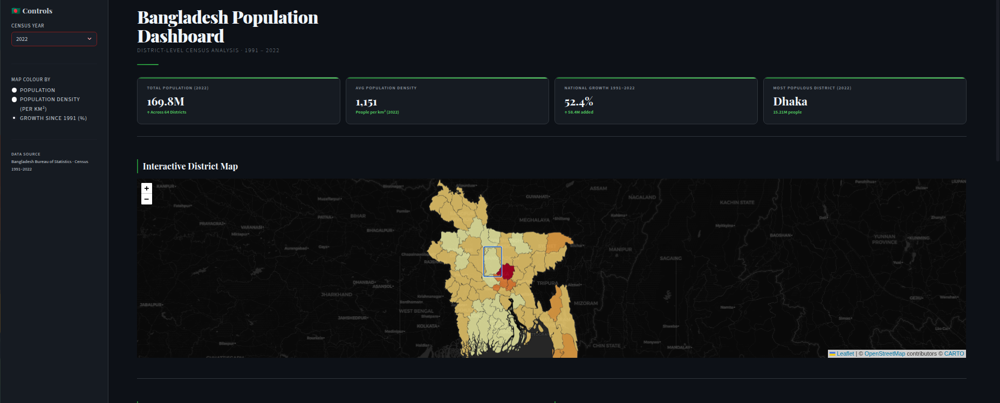

# Bangladesh Population Dashboard

An interactive Streamlit dashboard for exploring district-level population trends in Bangladesh from 1991 to 2022.

## Demo GIF


## Project Screenshot



## Features

- Census year selector (1991, 2001, 2011, 2022)
- Interactive choropleth map by district
- Map metrics:
- Population
- Population density (per km²)
- Growth since 1991 (%)
- National KPI cards (population, density, growth, most populous district)
- Clickable district details on map
- Top 10 rankings:
- Most populous districts
- Fastest-growing districts (1991-2022)
- Auto-generated demographic summary report

## Tech Stack

- Python
- Streamlit
- Pandas
- Folium + `streamlit-folium`

## Project Structure

```text
dashboard_BD/
├── app.py              # Main Streamlit app
├── data.csv            # District population + area dataset
├── bangladesh.json     # District boundary GeoJSON
├── styles.css          # Custom dashboard styling
└── requirements.txt    # Python dependencies
```

## Setup

1. Clone the repository and move into the project folder.
2. Create and activate a virtual environment (recommended).
3. Install dependencies:

```bash
pip install -r requirements.txt
```

## Run the App

```bash
streamlit run app.py
```

Then open the local URL shown in your terminal (usually `http://localhost:8501`).

## Data Source

Bangladesh Bureau of Statistics (BBS) census data (1991-2022), prepared in `data.csv`, with district boundaries from `bangladesh.json`.
